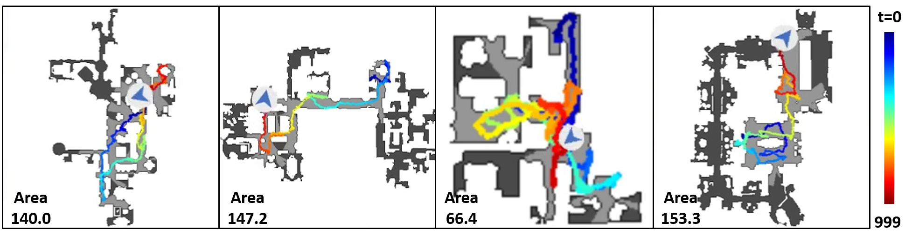
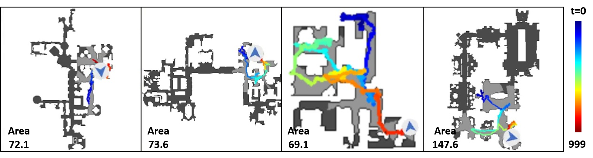
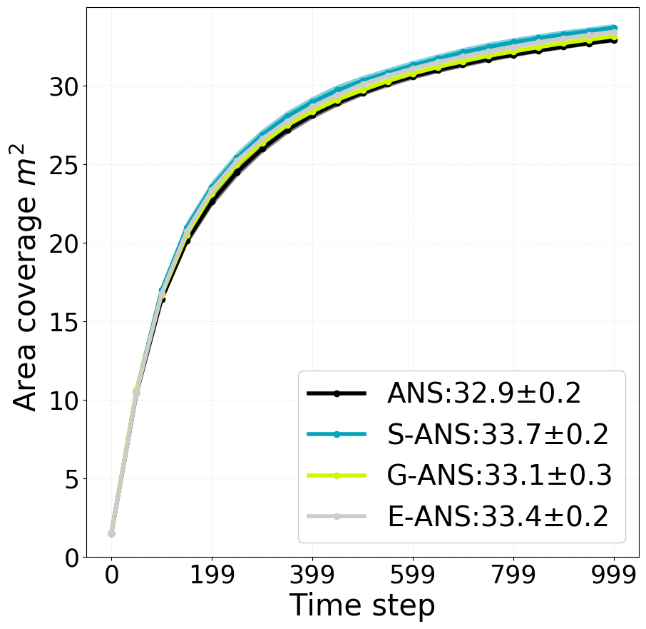
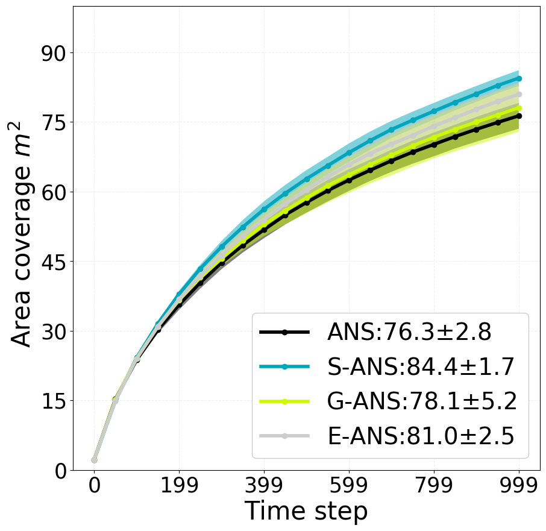

<h1 align="center">
<a href="https://openaccess.thecvf.com/content/CVPR2022/papers/Liu_Symmetry-Aware_Neural_Architecture_for_Embodied_Visual_Exploration_CVPR_2022_paper.pdf">Symmetry-aware Neural Architecture for Embodied Visual Exploration</a> [CVPR2022] </h1>
<h4 align="center">by Shuang Liu, Okatani Takayuki</h4>

 
# Results
## Exploration trajectory and coverage: our method v.s. the baseline method

![test image size]
![test image size]
## Ablation study
<!-- Gibson             |  Matterport3D
:-------------------------:|:-------------------------:
 |   -->
Gibson             |  Matterport3D
:-------------------------:|:-------------------------:
 | 
<!-- <p align="middle">
  
   
</p> -->


# Abstract
Visual exploration is a task that seeks to visit all the navigable areas of an environment as quickly as possible. The existing methods employ deep reinforcement learning (RL) as the standard tool for the task. However, they tend to be vulnerable to statistical shifts between the training and test
data, resulting in poor generalization over novel environments that are out-of-distribution (OOD) from the training data. In this paper, we attempt to improve the generalization ability by utilizing the inductive biases available for the task. Employing the active neural SLAM (ANS) that learns exploration policies with the advantage actor-critic (A2C) method as the base framework, we first point out that the mappings represented by the actor and the critic should satisfy specific symmetries. We then propose a network design for the actor and the critic to inherently attain these symmetries. Specifically, we use G-convolution instead of the standard convolution and insert the semi-global polar pooling (SGPP) layer, which we newly design in this study, in the last section of the critic network. Experimental results show that our method increases area coverage by $8.1m^2$ when trained on the Gibson dataset and tested on the MP3D
dataset, establishing the new state-of-the-art.
# Install
In order to run the scripts, please follow the steps below;
1. Please download and install the implementation of [Occupancy](https://github.com/facebookresearch/OccupancyAnticipation) as required.
2. Replace `ans.py`, `policy.py` and `occant_exp_trainer.py` in `occant_baselines/rl` with `ans.py`, `policy.py` and `occant_exp_trainer.py` in our directory.
3. Copy `./SANS/config/train/*yaml` and `./SANS/config/test/*yaml` to `configs/model_configs/ans_depth`.

# Training
1. To train ANS, please run 
```
python run.py --exp-config configs/model_configs/ans_depth/ppo_exploration_cat_allolocal_alloglobal_cart_ansnet.yaml --run-type train
```
2. To train S-ANS, please run 
```
python run.py --exp-config configs/model_configs/ans_depth/ppo_exploration_allolocal_alloglobal_cart_ansnetexact_shareconv_rllocal__actorBP_criticBPGPP.yaml --run-type train
```
# Testing
1. To evaluate ANS on Gibson, please run
```
python run.py --exp-config configs/model_configs/ans_depth/ppo_exploration_myeval_novideo_cat_allolocal_alloglobal_cart_ansnet.yaml --run-type eval
```
2. To evaluate ANS on MP3D, please run
python run.py --exp-config configs/model_configs/ans_depth/ppo_exploration_myeval_mp3d_novideo_cat_allolocal_alloglobal_cart_ansnet.yaml --run-type eval
3. To evaluate S-ANS on Gibson, please run
```
python run.py --exp-config configs/model_configs/ans_depth/ppo_exploration_myeval_video_allolocal_alloglobal_cart_ansnetexact_shareconv_rllocal__actorBP_criticBPGPP.yaml --run-type eval
```
4. To evaluate S-ANS on MP3D, please run
```
python run.py --exp-config configs/model_configs/ans_depth/ppo_exploration_myeval_mp3d_video_allolocal_alloglobal_cart_ansnetexact_shareconv_rllocal__actorBP_criticBPGPP.yaml --run-type eval
```
# ACKNOWLEDGMENT
We use parts of the code from [Occupancy Anticipation](https://github.com/facebookresearch/OccupancyAnticipation) and [Active Neural SLAM](https://github.com/devendrachaplot/Neural-SLAM). We thank the authors for sharing their code publicly.
